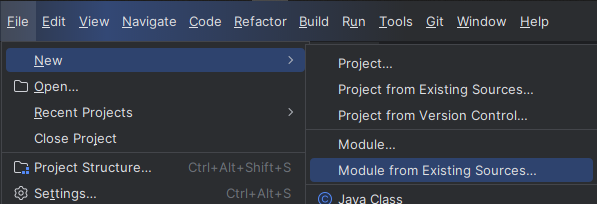

# Microservices Study
My notes and code from https://www.udemy.com/course/master-microservices-with-spring-docker-kubernetes
- Course Reference: https://github.com/eazybytes/microservices

## Microservices
An architecture style that enables building enterprise web applications. It separates business domain logic into 
different services ideally each one with its own database. It allows not only parallel development, but horizontal 
scaling. On the other side, it has some management complexity and infrastructure overhead, but it allows the deployment
of a single service without the need of deploying the whole application.

Other architecture styles are:
- **Monolith:** Deployed as a single structure. Smaller application for smaller teams. Fewer cross-cutting concerns. 
Better performance between concerns and domains. The whole application must follow the same set of technologies, as it
grows larger becomes harder to maintain and small changes demand a full deployment;
- **SOA (Service Oriented Architecture):** Separates concerns into services that can be worked in parallel. These 
services can be reused and better balanced. Its management, however is more complex than the monolith architecture and
the communication between services demands a complex  and overloaded protocol (e.g. SOAP).

### Important
When developing microservices, bear in mind:
- Defining boundaries (DDD);
- Containerization (Docker);
- Management/Configuration;
- Service Discovery & registration (Eureka);
- Building an Edge Server;
- Resiliency (Resiliency4J);
- Observability & Monitoring (Grafana, Prometheus, etc.);
- Security (OAuth2/OpenID);
- Event Driven (RabbitMQ, Kafka);
- Orchestration (Kubernetes);
- Cloud Deployment;

## Communication 
- Synchronous messaging: Representational State Transfer (REST)
- Asynchronous messaging:
  - Queue managers (e.g. RabbitMQ, IBM MQ)
  - Message broadcast managers (Kafka)

### Notes regarding REST
- Use verbs for CRUD operations (GET, POST, PUT, PATCH, DELETE, etc.)
- Validate inputs and return proper HTTP error codes and messages
- Document the API (Open API, Swagger, etc.)

## A Basic Spring Web Application

- Using Spring Initializer


- Adding it as a module in IntelliJ


- Using YAML files instead of properties files

### Layered Monolithic Architecture
```
Client (HTTP) -> Controller -> Service -> Repository -> Database
                     |                        |
                   Mapper                JPA/Hibernate
```

## H2 Database:

Creating a "schema.sql" file under "main/resources", H2 will create the tables when starting up.

To be able to access the H2 memory database using IntelliJ, besides the web h2-console.
Check:
- [Querying the embedded H2 database of a Spring Boot application](http://web.archive.org/web/20160513065923/http://blog.techdev.de/querying-the-embedded-h2-database-of-a-spring-boot-application/).
- H2ServerConfiguration.class

## Spring Rest Controller
Go deeper on:
```
(application.properties) server.servlet.context-path=/api

@RequestMapping(value = "path", produces = {MediaType.APPLICATION_JSON_VALUE})
@GetMapping / @PostMapping / @PutMapping / @DeleteMapping / @PatchMapping
@RequestBody / @RequestParam / @PathVariable
ResponseEntity

@ResponseStatus vs. @ControllerAdvice / @ExceptionHandler
```

## Using JPA

Go deeper on:
```
@MappedSuperclass vs. other mapping methods
@Column specifics (e.g. updatable = false, insertable = false)

@EntityListeners / @PrePersist / @PreUpdate

... extends JpaRepository
Optional<T> findByXXX(T xxx)

@Transactional

How to use Spring returning Optional and Hibernate Proxy? No persistence context? Always a new select?

jpa.show-sql=true
jpa.properties.hibernate.format_sql=true
logging.level.org.hibernate.orm.jdbc.bind=trace
```

## Using Lombok

Go deeper on:
```
@Builder / @SuperBuilder

@Data
JPA entities shouldn't have @Data
```

## Validators

Go deeper on:
```
Validation constraints (e.g. @NotBlank, @Size, @Email, @NotNull, @Pattern, etc.)
@Validation / @Valid

extends ResponseEntityExceptionHandler
override handleMethodArgumentNotValid
```

## Auditing

Go deeper on:
```
XXX implements AuditorAware<?>
@EnableJpaAuditing(auditorAwareRef = "XXX") + @Component("XXX")
@EntityListeners(AuditingEntityListener.class)

Spring's "AuditingEntityListener" vs. My own "BaseEntityListener"
 
[@PrePersist / @PreUpdate] vs. [@CreatedDate / @CreatedBy / @LastModifiedDate / @LastModifiedBy]
```

## API Documentation

Check: https://springdoc.org/

Just add the dependency (no security at this time).

Note that context-path is "api", so should go to: http://localhost:8080/api/swagger-ui/index.html

Validations are used to improve the documentation

Go deeper on: 
```
@OpenApiDefinition
  @Info
    @Contact
    @License
  @ExternalDocumentation(

@Tag

@Operation
  @ApiResponse vs. @ApiResponses
    @Content
  
@Schema
```