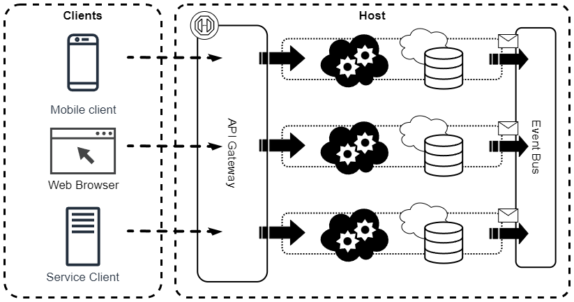
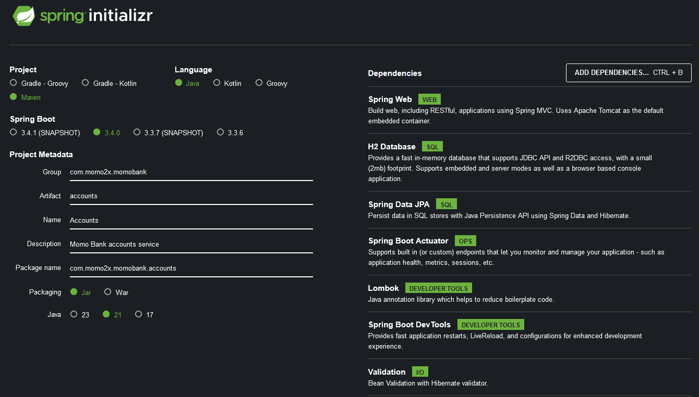

# Microservices Study

My notes and code from https://www.udemy.com/course/master-microservices-with-spring-docker-kubernetes
- Course Reference: https://github.com/eazybytes/microservices



**Table of Contents**

<!-- TOC -->
* [Microservices Study](#microservices-study)
  * [Microservices](#microservices)
    * [Important](#important)
      * [Identifying Boundaries](#identifying-boundaries)
  * [Configuration Management](#configuration-management)
  * [Cloud Native](#cloud-native)
    * [Cloud Native vs. Traditional Enterprise](#cloud-native-vs-traditional-enterprise)
    * [Development Principles](#development-principles)
      * [12/15-Factor methodology](#1215-factor-methodology)
        * [Characteristics:](#characteristics)
        * [Principles:](#principles)
          * [1) 1 Code base, 1 Application](#1-1-code-base-1-application)
          * [2) API first](#2-api-first)
          * [3) Dependency management](#3-dependency-management)
          * [4) Design, build, release, run](#4-design-build-release-run)
          * [5) Configuration, credentials & code](#5-configuration-credentials--code)
          * [6) Logs](#6-logs)
          * [7) Disposability](#7-disposability)
          * [8) Backing services](#8-backing-services)
          * [9) Environment parity](#9-environment-parity)
          * [10) Administrative processes](#10-administrative-processes)
          * [11) Port binding](#11-port-binding-)
          * [12) Stateless processes](#12-stateless-processes)
          * [13) Concurrency](#13-concurrency)
          * [14) Telemetry](#14-telemetry)
          * [15) Authentication & Authorization](#15-authentication--authorization)
  * [Communication](#communication)
    * [Notes regarding REST](#notes-regarding-rest)
  * [A Basic Spring Web Application](#a-basic-spring-web-application)
    * [Layered Monolithic Architecture](#layered-monolithic-architecture)
    * [Reading properties](#reading-properties)
      * [@ConfigurationProperties](#configurationproperties)
    * [Profiles](#profiles)
      * [Activating a profile](#activating-a-profile)
    * [H2 Database:](#h2-database)
    * [Spring Rest Controller](#spring-rest-controller)
    * [Using JPA](#using-jpa)
    * [Using Lombok](#using-lombok)
    * [Validators](#validators)
    * [Auditing](#auditing)
    * [API Documentation](#api-documentation)
  * [Spring Cloud Config](#spring-cloud-config)
    * [Configuration](#configuration)
      * [Classpath config](#classpath-config)
      * [Filesystem config](#filesystem-config)
      * [Git config](#git-config)
      * [Using actuator: refresh config "on-the-fly"](#using-actuator-refresh-config-on-the-fly)
      * [Connecting to the services](#connecting-to-the-services)
      * [Using a Message broker](#using-a-message-broker)
    * [A Complete Local / Remote Cloud Configuration](#a-complete-local--remote-cloud-configuration)
  * [Docker](#docker)
    * [Containers vs. Virtual Machines](#containers-vs-virtual-machines)
      * [NOTE! Using two OS simultaneously](#note-using-two-os-simultaneously)
    * [Images & Container](#images--container)
    * [Generating Docker Images:](#generating-docker-images)
      * [Dockerfile](#dockerfile)
      * [Buildpacks](#buildpacks)
      * [Google Jib](#google-jib)
      * [Comparison](#comparison)
    * [Push images to Docker hub](#push-images-to-docker-hub)
    * [Docker Compose](#docker-compose)
    * [Docker Desktop extensions](#docker-desktop-extensions)
  * [RabbitMQ](#rabbitmq)
  * [Git Webhooks](#git-webhooks)
    * [Hookdeck](#hookdeck)
<!-- TOC -->

## Microservices

An architecture style that enables building enterprise web applications. It separates business domain logic into 
different services ideally each one with its own database. It allows not only parallel development, but horizontal 
scaling. On the other side, it has some management complexity and infrastructure overhead, but it allows the deployment
of a single service without the need of deploying the whole application.

Other architecture styles are:
- **Monolith:** Deployed as a single structure. Smaller application for smaller teams. Fewer cross-cutting concerns. 
Better performance between concerns and domains. The whole application must follow the same set of technologies, as it
grows larger becomes harder to maintain and small changes demand a full deployment;
- **SOA (Service Oriented Architecture):** Separates concerns into services that can be worked in parallel. These 
services can be reused and better balanced. Its management, however is more complex than the monolith architecture and
the communication between services demands a complex  and overloaded protocol (e.g. SOAP).

### Important

When developing microservices, bear in mind:
- Defining boundaries (DDD);
- Containerization (Docker);
- Management/Configuration;
- Service Discovery & registration (Eureka);
- Building an Edge Server;
- Resiliency (Resiliency4J);
- Observability & Monitoring (Grafana, Prometheus, etc.);
- Security (OAuth2/OpenID);
- Event Driven (RabbitMQ, Kafka);
- Orchestration (Kubernetes);
- Cloud Deployment;

#### Identifying Boundaries

* DDD - Domain Driven design
  * Talk to Domain experts, Business Analysts, users, etc.
  * Keep continuous analysis to prevent growing or shrinking too much, in order to split in other servers or to be  
absorbed by another one. 
  * This process takes  along amount of time
* Event Storming Sizing
  * https://www.lucidchart.com/blog/ddd-event-storming
  * Identify events in the system: "completed payment", "list of products"
  * Identify commands from the events
  * Identify reactions from the commands

## Configuration Management

How to:
- Individualize config properties in order that multiple instances of the same service can be deployed in multiple envs?
- Inject configuration values to the container according to its environment during start up or even on-the-fly?
- How to centralize all config properties along its versions?

Solutions:
- Use Spring Boot properties with profiles (not good, too limited)
- Apply external configuration with Spring Boot (Also hard to maintain with multiple instances of a service)
- Implement a Spring Cloud Config Server

Considerations:
- Security: 
  - Access: people cannot have access to your configuration values
  - Encryption 
- History: Audit & Revision of configuration values
- Easy to manage: Multiple services instances configuration management
- Availability: On-the-fly configuration change

Example (using a Message Broker and GitHub repository:


## Cloud Native

Create applications designed for cloud computing. Get the full CNCF definition [here](https://github.com/cncf/toc/blob/main/DEFINITION.md).
Basically it is a set of practices that allow your application to run in any cloud environment.

1. Microservices (Loosely coupled services developed, deployed and scaled independently)
2. Containers (Lightweight, portable environments)
3. Scalable & Elastic (Scale horizontally)
4. DevOps practices (Collaboration Devs + Ops, CI/CD, ...)
5. Resilient & Fault tolerance (distributes, load balancing, failure recovery, high availability, ...)
6. Cloud-Native services (cloud platform: AWS, GCP, Azure, ...)

### Cloud Native vs. Traditional Enterprise

_Note: Not sure if I agree with all of this. Those are the course instructor's opinion_

1. Predictability (Error per service vs. Error per whole application)
2. OS Abstraction (due to containerization)
3. Oversize & Dependency (Low vs. High)
4. Delivery (Continuous vs. Waterfall)
5. Recovery & Scalability (Fast & High vs. Slow & Low)

### Development Principles

#### 12/15-Factor methodology

Based on [The Twelve-Factor App](https://12factor.net/)
and [Beyond the Twelve-Factor App](https://raw.githubusercontent.com/ffisk/books/master/beyond-the-twelve-factor-app.pdf).

##### Characteristics:

- Cloud Platform Deployment: platform independent
- Scalability as a Core Attribute: Horizontal scalability must be supported
- System Portability: Cloud technology-agnostic
- Continuous Deployment & Agility: Facilitate agile development cycles

##### Principles:

|   |                                   |    |                          |    |                                |
|---|-----------------------------------|----|--------------------------|----|--------------------------------|
| 1 | 1 Code base, 1 Application        | 6  | Logs                     | 11 | Port binding                   |
| 2 | API first                         | 7  | Disposability            | 12 | Stateless processes            |
| 3 | Dependency management             | 8  | Backing services         | 13 | Concurrency                    |
| 4 | Design, build, release, run       | 9  | Environment parity       | 14 | Telemetry                      |
| 5 | Configuration, credentials & code | 10 | Administrative processes | 15 | Authentication & Authorization |

###### 1) 1 Code base, 1 Application

- In real life, each microservice must have its own repository.
- Configurations must be injected externally during deployment (or on'-the-fly?)
- The same codebase must be used in development, testing and production environments

###### 2) API first

- Prioritize upfront API design
- Encourage division of work
- Allow asynchronous development

###### 3) Dependency management

- Declare all dependencies in a manifest
- Use dependence managers like Maven or Gradle

###### 4) Design, build, release, run

- Design stage: determine techs, dependencies and tools
- Build stage: compile and package to a unique identifiable immutable artifact
  - Use semantic versioning or timestamp versioning
- Release stage: Combine the build to a deployment configuration
  - Facilitate rollback through a central repository storage
- Run stage: Execute the application using a release

###### 5) Configuration, credentials & code

- Do not embed configuration in the code
- Enable change configurations independently of environment
- Resources for backing services (i.e. databases, messaging, credentials etc.)
- Do not expose sensitive configurations in the public
- Store configuration in a distinct, private repository

###### 6) Logs

- Log storage is an external tool responsibility
- Redirect logs to the standard output
- Treat logs sequentially according to timestamp
- Aggregate all logs in an external tool

###### 7) Disposability

- Application in the clouds are considered ephemeral
- It must be possible to terminate a service and replace it with a new instance
- Applications can be started and stopped as needed
- Design applications for fast start up and graceful shutdown

###### 8) Backing services

- Databases, message brokers, caching systems, etc.
- Different backing service instances per environment
- Manage each instance using resource binding per environment

###### 9) Environment parity

- Minimize difference between environments
- Use containers
- Address:
  - Time gap: The time between development and deployment. Use Continuous Integration and development
  - People gap: address the difference between roles. Use DevOps culture
  - Tools gap: Use the same tools regardless environment (e.g. same database tech in dev, test and production)

###### 10) Administrative processes

- Non-functional tasks, like migrations and maintenance should be treated as an isolated process 
- These processes are equally important and must be properly tracked, tested and deployed
- But separate the administrative tasks from the business logic of the service

###### 11) Port binding 

**NOTE: To be reviewed**

- Translate external public endpoints to internal endpoints
- Can be an application, externally visible, that requests to internal microservices application
- GraphQL, for example?

###### 12) Stateless processes

- Do not store anything in the service container instance because it will be lost if it is destroyed
- Important to achieve scalability
- Share-nothing architecture
- Use database backing services to store the state

###### 13) Concurrency

- Serve large number of users simultaneously
- Must be horizontally scalable
- Java use thread pools

###### 14) Telemetry

- Be able to monitor logs, metrics, traces, health status, events, etc. (observability)
- Monitor a large number of services and servers
- Remote monitoring

###### 15) Authentication & Authorization

- Security is a critical aspect
- Zero-trust approach
- External and internal communication must follow security standards
- Authentication & authorization, Code injection prevention: developer responsibility
  - Authentication: track who is using the system
  - Authorization: who has access to what
- HTTPS, SSL certificates, Firewall: platform team responsibility 

## Communication

- Synchronous messaging: Representational State Transfer (REST)
- Asynchronous messaging:
  - Queue managers (e.g. RabbitMQ, IBM MQ)
  - Message broadcast managers (Kafka)

### Notes regarding REST

- Use verbs for CRUD operations (GET, POST, PUT, PATCH, DELETE, etc.)
- Validate inputs and return proper HTTP error codes and messages
- Document the API (Open API, Swagger, etc.)

## A Basic Spring Web Application

- Using Spring Initializer


- Adding it as a module in IntelliJ


- Using YAML files instead of properties files

### Layered Monolithic Architecture

```
Client (HTTP) -> Controller -> Service -> Repository -> Database
                     |                        |
                   Mapper                JPA/Hibernate
```

### Reading properties

Go deeper on:
```
@Value
environment.getProperty("...")
@ConfigurationProperties
```

#### @ConfigurationProperties

There are 3 ways of using Configuration Properties:

(1) Configuration class with POJO and bean declaration
```java
@Configuration
public class AccountsConfigProperties {
    @Bean @ConfigurationProperties(prefix = "someprefix")
    public PojoClass myBeanName() {
        return new PojoClass();
    }
}
```
Pros:
- Decoupled bean creation
- No extra annotation needed
- Allows changing values in runtime

Cons:
- One more class to manage
- Another bean to keep track

(2) Annotated main class with annotated record

```java
@ConfigurationProperties(prefix = "someprefix")
public record SimpleRecord(SomeType someAttribute) {
}
```
```java
@EnableConfigurationProperties(value = SimpleRecord.class)
@SpringBootApplication
public class AccountsApplication {
	public static void main(String[] args) {
		run(AccountsApplication.class, args);
	}
}
```
Pros:
- No extra configuration class
- No extra bean to manage
- Use of records

Cons:
- Extra annotation in record and main class
- Couples the record to the Spring framework
- Does not allow changing values in runtime

(3) Annotated main class with annotated pojo

```java
@Getter
@Setter
@ConfigurationProperties(prefix = "someprefix")
public class SimpleClass {
  private SomeType someAttribute;
}
```
```java
@EnableConfigurationProperties(value = SimpleClass.class)
@SpringBootApplication
public class AccountsApplication {
	public static void main(String[] args) {
		run(AccountsApplication.class, args);
	}
}
```
Pros:
- Same as approach (2), without the use of records
- Same as approach (2), but allows changing values in runtime

### Profiles

Create many application.properties (or .yml) with the following:

```properties
spring.config.activate.on-profile="<profile1>"
spring.config.import="application_<profile1>.yml", "application_<profile2>.yml"
```
or
```yaml
spring:
  config:
    import:
      - "application_<profile1>.yml"
      - "application_<profile2>.yml"
    activate:
      on-profile: "<profile1>"
```
Example:
- Default (empty): application.properties
- QA: application_qa.properties
- Production: application_prod.properties

**NOTE!** Put in the main "application" file everything that is shared between profiles amd the default values for a 
development environment. In other files, put only what is specific for the environment, there is no need to repeat the 
same values that are already defined in the main "application" file.

#### Activating a profile

- (Not recommended) Can set the following property in applications (properties or yml): `spring.profiles.active`.
- Use command-line arguments (by precedence):
  - Normal command-line args: `java -jar my-application-service.jar --spring.profiles.active="<profile>"`
  - Use environment variable (linux): `SPRING_PROFILES_ACTIVE="<profile>" java -jar my-application-service.jar`
 
### H2 Database:

Creating a "schema.sql" file under "main/resources", H2 will create the tables when starting up.

To be able to access the H2 memory database using IntelliJ, besides the web h2-console.
Check:
- [Querying the embedded H2 database of a Spring Boot application](http://web.archive.org/web/20160513065923/http://blog.techdev.de/querying-the-embedded-h2-database-of-a-spring-boot-application/).
- H2ServerConfiguration.class

### Spring Rest Controller

Go deeper on:
```
(application.properties) server.servlet.context-path=/api

@RestController = @Controller + @ResponseBody

@RequestMapping
  path
  MediaType.APPLICATION_JSON_VALUE

@GetMapping / @PostMapping / @PutMapping / @DeleteMapping / @PatchMapping
@RequestBody / @RequestParam / @PathVariable
@RequestHeader

RequestEntity<T>
ResponseEntity<T>

@ResponseStatus vs. @ControllerAdvice / @ExceptionHandler
```

### Using JPA

Go deeper on:
```
@MappedSuperclass vs. other mapping methods
@Column specifics (e.g. updatable = false, insertable = false)

@EntityListeners / @PrePersist / @PreUpdate

... extends JpaRepository
Optional<T> findByXXX(T xxx)

@Transactional

How to use Spring returning Optional and Hibernate Proxy? No persistence context? Always a new select?

jpa.show-sql=true
jpa.properties.hibernate.format_sql=true
logging.level.org.hibernate.orm.jdbc.bind=trace
```

### Using Lombok

Go deeper on:
```
@Builder / @SuperBuilder

@Data
JPA entities shouldn't have @Data
```

### Validators

Go deeper on:
```
Validation constraints (e.g. @NotBlank, @Size, @Email, @NotNull, @Pattern, etc.)
@Validation / @Valid

extends ResponseEntityExceptionHandler
override handleMethodArgumentNotValid
```

### Auditing

Go deeper on:
```
XXX implements AuditorAware<?>
@EnableJpaAuditing(auditorAwareRef = "XXX") + @Component("XXX")
@EntityListeners(AuditingEntityListener.class)

Spring's "AuditingEntityListener" vs. My own "BaseEntityListener"
 
[@PrePersist / @PreUpdate] vs. [@CreatedDate / @CreatedBy / @LastModifiedDate / @LastModifiedBy]
```

### API Documentation

Check: https://springdoc.org/

Just add the dependency (no security at this time).

Note that context-path is "api", so should go to: http://localhost:8080/api/swagger-ui/index.html

Validations are used to improve the documentation

Go deeper on: 
```
@OpenApiDefinition
  @Info
    @Contact
    @License
  @ExternalDocumentation(

@Tag

@Operation
  @ApiResponse vs. @ApiResponses
    @Content
  
@Schema
```

## Spring Cloud Config


Go deeper on:
```
@EnableConfigServer
```

Can be stored in:
- classpath
- filesystem
- git
- database
- AWS s3
- etc.

### Configuration

For the full detail, check:
- https://docs.spring.io/spring-cloud-config/docs/current/reference/html/#_environment_repository

For all services (config also):
```xml
<dependency>
    <groupId>org.springframework.cloud</groupId>
    <artifactId>spring-cloud-starter-config</artifactId>
</dependency>
```

For automatic config refresh (all):
```xml
<dependency>
    <groupId>org.springframework.boot</groupId>
    <artifactId>spring-boot-starter-actuator</artifactId>
</dependency>
```

For the config server:
```xml
<dependencyManagement>
    <dependencies>
        <dependency>
            <groupId>org.springframework.cloud</groupId>
            <artifactId>spring-cloud-dependencies</artifactId>
            <version>${spring-cloud.version}</version>
            <type>pom</type>
            <scope>import</scope>
        </dependency>
    </dependencies>
</dependencyManagement>
```
#### Classpath config

- Multiple configs per service (.properties or .yml). Note, use "-" (hyphen), not "_" (underscore).
  - service1, service1-qa, service1-prod
  - service2, service2-qa, service2-prod
  - ...
- Remove all that is not necessary to externalize and it is not environment dependent
  - Also `spring.config.activate.on-profile` and `config.import` properties are no longer necessary
- Add `spring.profiles.active=native` and `spring.cloud.config.server.native.search-locations="classpath:/config-dir"` to 
application (.properties or .yml)

You can access the configuration through HTTP:
```
protocol://server:port/service/environment
```
Example:
```
http://localhost:8071/accounts/prod
```

#### Filesystem config

- Move all files to a path inside the server
- Change `spring.cloud.config.server.native-search-locations` value for `file:///path//to//config//dir`

#### Git config

- Move all files to a new git repository (ex: config-repository)
- Change `spring.profiles` to `git`
- Add `spring.cloud.config.server.git.uri` to `"git@github.com:username/config-repository.git"`
- Add `spring.cloud.config.server.git.passphrase` to `"<user-passphrase>"` (do not commit this to a public repository!)
  - In the future, I will use a private and public key or some other type of more secure authentication
- Add `spring.cloud.config.server.git.default-label` to `main`
- Add `spring.cloud.config.server.git.clone-on-start` to `true`
- Add `spring.cloud.config.server.git.force-pull` to `true`

#### Using actuator: refresh config "on-the-fly"

- Have actuator dependency
- Have a mutable configuration class (see [@configurationproperties](#configurationproperties))
- Set `management.endpoints.web.exposure.include="*"` config property (expose all endpoints managed by actuator)

#### Connecting to the services

In your service, there is no need for an application_<profile>, in case it exists, so...
- Delete all application_<profile>
- Delete `spring.config.import` and `spring.config.profiles.active` from the application file
- Delete any property that has been migrated to the cloud config file
- Set `spring.application.name` to the same value in the cloud config file. For example, for a file named `service.yml`
set the property value to `service`
- (?) Set `spring.profile.active` (to, "qa" or "prod") (didn't understand why? Isn't it dynamic?)
- Add the Cloud Config Client dependency in the pom.xml
- Add the Cloud dependency management to the pom.xml
- Add `spring.config.import` property to the application file with value: `configserver:protocol://server:port`, 
(e.g. `configserver:http://localhost:8071`)

#### Using a Message broker

TBD

### A Complete Local / Remote Cloud Configuration


## Docker

Simply put, **Docker** is the software that allows creating containers.  

### Containers vs. Virtual Machines

Virtualization is a way to use a single machine to run many environments simulating several machines working at the same 
time, but while "Virtual Machines" are capable to run diverse operating systems, allowing to simulate deploying a system
to a Mac and a Linux OS, containers share the same OS kernel, meaning that all of them will simulate running in the same 
OS. However, having multiple Virtual Machines in the same machine wil demand more processing and memory than having 
multiple containers.


#### NOTE! Using two OS simultaneously

Docker allows using Windows and Linux containers simultaneously in a Windows machine. Check 
[Running Docker Windows and Linux Containers Simultaneously](https://devblogs.microsoft.com/premier-developer/running-docker-windows-and-linux-containers-simultaneously/)

### Images & Container
- The **image** is a blueprint of an environment that will hold the service we are building; 
- The **container** is an instance of an image running the service in an isolated environment. 

### Generating Docker Images:

- Dockerfile
- Buildpacks
- Google Jib

#### Dockerfile

Needs more manual steps and must know more of Docker internals.

1. Create your artifact (`mvn clean install`)
2. Create your Dockerfile (`FROM`/`COPY`/`ENTRYPOINT`)
3. Create your image (`docker build`)
4. Run your container (`docker run`)

#### Buildpacks

Does not need to know Docker internals, just add a configuration to the existing plugin. For professional deployment, it
seems to be a more complete tool than the next one, Google Jib.

1. Edit `pom.xml` (spring-boot-maven-plugin), add: `configuration` / `image` / `name`
2. Create your image (`mvn spring-boot:build-image`)
3. Run your container (`docker run`)

#### Google Jib

Faster than Buildpacks. Need to add a plugin to pom.xml.

1. Edit `pom.xml`, add `jib-maven-plugin`
2. Create your image (`mvn compile jib:dockerBuild`)
3. Run your container (`docker run`)

#### Comparison

- [Buildpacks vs Jib vs Dockerfile: Comparing containerization methods](https://cloud.google.com/blog/topics/developers-practitioners/comparing-containerization-methods-buildpacks-jib-and-dockerfile)
- [Buildpacks.io comparison page](https://buildpacks.io/features/#comparison)

### Push images to Docker hub

```shell
docker image push docker.io/username/imagename:tag
```

### Docker Compose

- Create a `docker-compose-yml` file
- Run `docker compose up` command

### Docker Desktop extensions

- Logs Explorer

## RabbitMQ

Check [RabbitMQ download page](https://www.rabbitmq.com/docs/download) for the latest versions.

From the time of this writing:
```shell
docker run -it --rm --name rabbitmq -p 5672:5672 -p 15672:15672 rabbitmq:4.0-management
```

## Git Webhooks

In the Config Repo:
- Click on "Settings" in the top menu
- Click on "Webhooks" on the left panel
- Click on the "Add webhook" button
- Fill:
  - Payload URL: The one provided by Hookdeck CLI

### Hookdeck

Used to use webhooks locally

1. Go to "https://hookdeck.com/"
2. Click on "Developer menu
3. Under "SDK & Tools", click on "Hookdeck Console"
4. Click on the button at the top: "Add Destination"
5. On the right panel, "Destination Settings", click on "Localhost" tab
6. Follow the steps to install and run it

(?) Do I have to run this everytime?
```shell
hookdeck login --cli-key 647oehcae04o7x2jwqfgv2ffmzc817xxh97owpcqgl8fpk42zy
hookdeck listen 8071 Source --cli-path /monitor
```
The result must be something similar to:
```
Dashboard
👉 Inspect and replay events: https://dashboard.hookdeck.com

Sources
🔌 Source URL: https://hkdk.events/hpr1yesq0a3bqf

Connections
Source -> Source_to_cli-Source forwarding to /monitor

> Ready! (^C to quit)
```

Copy the Source URL to be used as your Payload URL for the GitHub webhook. 